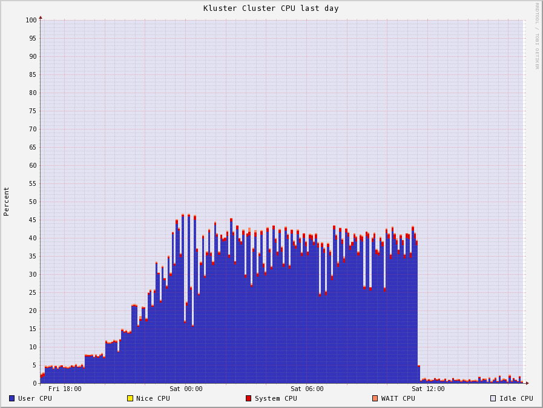
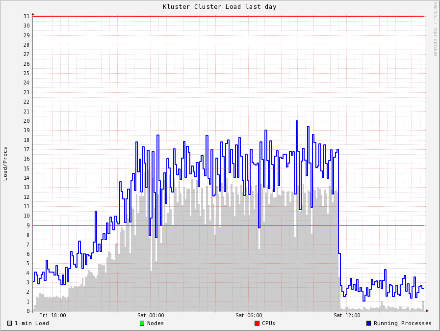
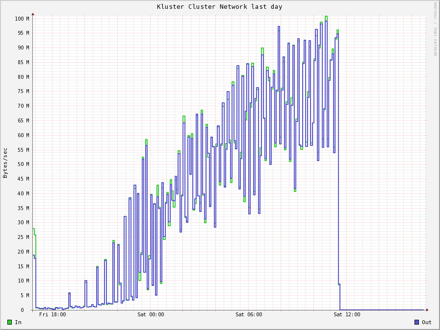
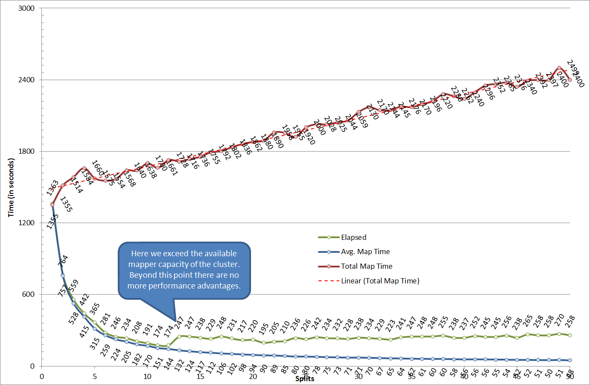

# Why?
People have asked me to provide some benchmarking information because they were skeptical about the advantages of this codec.

So this project is simply a WordCount implementation that runs the same file with various settings for this codec and (as a reference) against the default GzipCodec.

# Input
I took the list of installed rpms on my machine, replaced the '.' and '-' with ' ' and concatenated the gzipped version of this 100000 times.
The result was a file that was 1101900000 bytes in size (i.e. just below 1.1GB).

# The cluster
The cluster I ran this on is a series of 8 old developer workstations.
Master: 4 core CPU, single disk.
Workers: 7 systems (6x4 core, 1x2 core), all have a single disk.

Note that these systems do NOT have identical specifications. So in the below tables when running only a few mappers you see that 'it matters' which of these system was actually running that specific mapper.

Given the yarn config in place on this cluster can run at most 12 mappers simultaneously.

This cluster was fully idle during all benchmark runs.

All output files were checked and resulted in the same md5 of the output file.

# Results

# Conclusions
As long there is spare CPU capacity the solution allows for a very good scaling of the processing speed.
A file that would normally take about 24 minutes to 'wordcount' only takes about 3 minutes.

After the maximal parallelization point (12) we see that the processing time jumps up and stays there. This can be explained by the fact that only after the first mapper of the 12 mappers is finished the 13th can start.

## A 5.5 GB input file doing a wordcount

From the ganglia graphs of the cluster you can see that beyond the point of `no more free mappers` the only thing that really changes is that the cluster is moving more and more data around over the network.

Splitsize | Splits | Elapsed | Avg. Map Time | Total Map Time
 --:|--:|--:|--:|--:|
5509500001 | 1 | 7286 | 7278 | 7278
2754750001 | 2 | 3570 | 3530 | 7060
1836500001 | 3 | 2610 | 2486 | 7458
1377375001 | 4 | 1907 | 1835 | 7340
1101900001 | 5 | 1627 | 1499 | 7495
918250001 | 6 | 1273 | 1211 | 7266
787071429 | 7 | 1240 | 1142 | 7994
688687501 | 8 | 1160 | 1024 | 8192
612166667 | 9 | 1000 | 896 | 8064
550950001 | 10 | 858 | 806 | 8060
500863637 | 11 | 817 | 725 | 7975
459125001 | 12 | 819 | 694 | 8328
423807693 | 13 | 1189 | 653 | 8489
393535715 | 14 | 1181 | 609 | 8526
367300001 | 15 | 1189 | 579 | 8685
344343751 | 16 | 1104 | 545 | 8720
324088236 | 17 | 1099 | 512 | 8704
306083334 | 18 | 1015 | 488 | 8784
289973685 | 19 | 1000 | 471 | 8949
275475001 | 20 | 965 | 446 | 8920
262357143 | 21 | 940 | 432 | 9072
250431819 | 22 | 943 | 423 | 9306
239543479 | 23 | 1052 | 411 | 9453
229562501 | 24 | 1105 | 393 | 9432
220380001 | 25 | 1092 | 380 | 9500
211903847 | 26 | 1155 | 372 | 9672
204055556 | 27 | 1092 | 357 | 9639
196767858 | 28 | 1072 | 350 | 9800
189982759 | 29 | 1055 | 336 | 9744
183650001 | 30 | 1082 | 331 | 9930
177725807 | 31 | 998 | 313 | 9703
172171876 | 32 | 1038 | 315 | 10080
166954546 | 33 | 1063 | 303 | 9999
162044118 | 34 | 1059 | 304 | 10336
157414286 | 35 | 1201 | 298 | 10430
153041667 | 36 | 1110 | 286 | 10296
148905406 | 37 | 1097 | 281 | 10397
144986843 | 38 | 1095 | 274 | 10412
141269231 | 39 | 1106 | 274 | 10686
137737501 | 40 | 1108 | 271 | 10840
134378049 | 41 | 1097 | 263 | 10783
131178572 | 42 | 1206 | 262 | 11004
128127907 | 43 | 1195 | 258 | 11094
125215910 | 44 | 1195 | 257 | 11308
122433334 | 45 | 1197 | 248 | 11160
119771740 | 46 | 1150 | 248 | 11408
117223405 | 47 | 1174 | 244 | 11468
114781251 | 48 | 1179 | 240 | 11520
112438776 | 49 | 1176 | 238 | 11662
110190001 | 50 | 1212 | 237 | 11850

## A 1.1 GB input file doing a wordcount.

On a single machine simply running a `gzip -t <file>` takes about 45 seconds. So in general we can say that the longest running mapper cannot get below the 45 seconds.

Splitsize | Splits | Elapsed | Avg. Map Time | Total Map Time
 --:|--:|--:|--:|--:|
GzipCodec | 1 | 1401 | 1393 | 1393
1101900001 | 1 | 1363 | 1355 | 1355
550950001 | 2 | 764 | 757 | 1514
367300001 | 3 | 559 | 528 | 1584
275475001 | 4 | 442 | 415 | 1660
220380001 | 5 | 365 | 315 | 1575
183650001 | 6 | 281 | 259 | 1554
157414286 | 7 | 246 | 224 | 1568
137737501 | 8 | 234 | 205 | 1640
122433334 | 9 | 208 | 182 | 1638
110190001 | 10 | 191 | 170 | 1700
100172728 | 11 | 174 | 151 | 1661
91825001 | 12 | 174 | 144 | 1728
84761539 | 13 | 247 | 132 | 1716
78707143 | 14 | 247 | 124 | 1736
73460001 | 15 | 238 | 117 | 1755
68868751 | 16 | 229 | 112 | 1792
64817648 | 17 | 248 | 106 | 1802
61216667 | 18 | 231 | 102 | 1836
57994737 | 19 | 217 | 98 | 1862
55095001 | 20 | 220 | 94 | 1880
52471429 | 21 | 195 | 90 | 1890
50086364 | 22 | 205 | 89 | 1958
47908696 | 23 | 210 | 85 | 1955
45912501 | 24 | 236 | 80 | 1920
44076001 | 25 | 226 | 80 | 2000
42380770 | 26 | 242 | 78 | 2028
40811112 | 27 | 234 | 75 | 2025
39353572 | 28 | 232 | 73 | 2044
37996552 | 29 | 228 | 71 | 2059
36730001 | 30 | 238 | 71 | 2130
35545162 | 31 | 234 | 70 | 2170
34434376 | 32 | 229 | 67 | 2144
33390910 | 33 | 223 | 65 | 2145
32408824 | 34 | 241 | 64 | 2176
31482858 | 35 | 247 | 62 | 2170
30608334 | 36 | 248 | 61 | 2196
29781082 | 37 | 248 | 60 | 2220
28997369 | 38 | 255 | 60 | 2280
28253847 | 39 | 238 | 58 | 2262
27547501 | 40 | 237 | 56 | 2240
26875610 | 41 | 252 | 56 | 2296
26235715 | 42 | 245 | 56 | 2352
25625582 | 43 | 245 | 55 | 2365
25043182 | 44 | 256 | 54 | 2376
24486667 | 45 | 238 | 52 | 2340
23954348 | 46 | 265 | 52 | 2392
23444681 | 47 | 258 | 51 | 2397
22956251 | 48 | 258 | 50 | 2400
22487756 | 49 | 270 | 51 | 2499
22038001 | 50 | 258 | 48 | 2400

## A 220 MB input file doing a wordcount.

Splitsize | Splits | Elapsed | Avg. Map Time | Total Map Time
 --:|--:|--:|--:|--:|
GzipCodec |  1 | 274 sec | 267 sec |  267 sec
220380001 |  1 | 282 sec | 275 sec |  275 sec
110190001 |  2 | 156 sec | 150 sec |  300 sec
 73460001 |  3 | 120 sec | 110 sec |  330 sec
 55095001 |  4 |  89 sec |  81 sec |  324 sec
 44076001 |  5 |  70 sec |  64 sec |  320 sec
 36730001 |  6 |  66 sec |  59 sec |  354 sec
 31482858 |  7 |  55 sec |  48 sec |  336 sec
 27547501 |  8 |  53 sec |  44 sec |  352 sec
 24486667 |  9 |  49 sec |  40 sec |  360 sec
 22038001 | 10 |  46 sec |  37 sec |  370 sec
 20034546 | 11 |  44 sec |  35 sec |  385 sec
 18365001 | 12 |  43 sec |  33 sec |  396 sec
 16952308 | 13 |  59 sec |  30 sec |  390 sec
 15741429 | 14 |  57 sec |  29 sec |  406 sec
 14692001 | 15 |  62 sec |  27 sec |  405 sec
 13773751 | 16 |  59 sec |  26 sec |  416 sec
 12963530 | 17 |  56 sec |  26 sec |  442 sec
 12243334 | 18 |  57 sec |  24 sec |  432 sec
 11598948 | 19 |  53 sec |  23 sec |  437 sec
 11019001 | 20 |  54 sec |  22 sec |  440 sec
 10494286 | 21 |  53 sec |  21 sec |  441 sec
 10017273 | 22 |  60 sec |  21 sec |  462 sec
  9581740 | 23 |  58 sec |  20 sec |  460 sec
  9182501 | 24 |  58 sec |  20 sec |  480 sec
  8815201 | 25 |  60 sec |  19 sec |  475 sec
  8476154 | 26 |  62 sec |  20 sec |  520 sec
  8162223 | 27 |  57 sec |  18 sec |  486 sec
  7870715 | 28 |  64 sec |  18 sec |  504 sec
  7599311 | 29 |  64 sec |  18 sec |  522 sec
  7346001 | 30 |  62 sec |  18 sec |  540 sec
  7109033 | 31 |  61 sec |  17 sec |  527 sec
  6886876 | 32 |  62 sec |  16 sec |  512 sec
  6678182 | 33 |  62 sec |  16 sec |  528 sec
  6481765 | 34 |  64 sec |  16 sec |  544 sec
  6296572 | 35 |  70 sec |  16 sec |  560 sec
  6121667 | 36 |  64 sec |  16 sec |  576 sec
  5956217 | 37 |  68 sec |  15 sec |  555 sec
  5799474 | 38 |  67 sec |  15 sec |  570 sec
  5650770 | 39 |  70 sec |  15 sec |  585 sec
  5509501 | 40 |  72 sec |  15 sec |  600 sec
  5375122 | 41 |  72 sec |  15 sec |  615 sec
  5247143 | 42 |  69 sec |  14 sec |  588 sec
  5125117 | 43 |  73 sec |  14 sec |  602 sec
  5008637 | 44 |  71 sec |  14 sec |  616 sec
  4897334 | 45 |  72 sec |  13 sec |  585 sec
  4790870 | 46 |  72 sec |  13 sec |  598 sec
  4688937 | 47 |  72 sec |  13 sec |  611 sec
  4591251 | 48 |  77 sec |  13 sec |  624 sec
  4497552 | 49 |  83 sec |  14 sec |  686 sec
  4407601 | 50 |  85 sec |  13 sec |  650 sec

## A 140 MB input file doing a wordcount.

Splitsize | Splits | Elapsed | Avg. Map Time | Total Map Time
 --:|--:|--:|--:|--:|
139796017 |  1 | 170 sec | 162 sec | 162 sec |
 70000000 |  2 |  90 sec |  83 sec | 166 sec |
 50000000 |  3 |  66 sec |  58 sec | 174 sec |
 35000000 |  4 |  55 sec |  48 sec | 192 sec |
 28000000 |  5 |  49 sec |  42 sec | 210 sec |
 25000000 |  6 |  39 sec |  32 sec | 192 sec |
 20000000 |  7 |  38 sec |  30 sec | 210 sec |
 17500000 |  8 |  32 sec |  26 sec | 208 sec |
 15000000 | 10 |  32 sec |  23 sec | 230 sec |
 12500000 | 12 |  31 sec |  21 sec | 252 sec |
 11500000 | 13 |  44 sec |  19 sec | 247 sec |
 10000000 | 14 |  39 sec |  18 sec | 252 sec |
  5000000 | 28 |  42 sec |  11 sec | 308 sec |
  2500000 | 56 |  59 sec |   8 sec | 448 sec |

Splitsize | Splits | Elapsed | Avg. Map Time | Total Map Time
 --:|--:|--:|--:|--:|
139796017 |  1 | 167 sec | 159 sec | 159 sec |
 70000000 |  2 |  90 sec |  82 sec | 164 sec |
 50000000 |  3 |  65 sec |  57 sec | 171 sec |
 35000000 |  4 |  57 sec |  48 sec | 192 sec |
 28000000 |  5 |  48 sec |  41 sec | 205 sec |
 25000000 |  6 |  44 sec |  35 sec | 210 sec |
 20000000 |  7 |  38 sec |  29 sec | 203 sec |
 17500000 |  8 |  34 sec |  28 sec | 224 sec |
 15000000 | 10 |  31 sec |  22 sec | 220 sec |
 12500000 | 12 |  31 sec |  21 sec | 252 sec |
 11500000 | 13 |  43 sec |  19 sec | 247 sec |
 10000000 | 14 |  40 sec |  18 sec | 252 sec |
  5000000 | 28 |  43 sec |  12 sec | 336 sec |
  2500000 | 56 |  62 sec |   9 sec | 504 sec |

