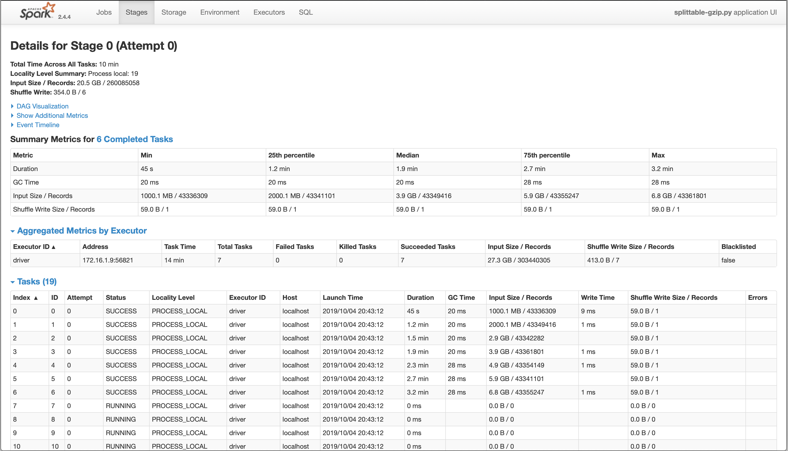
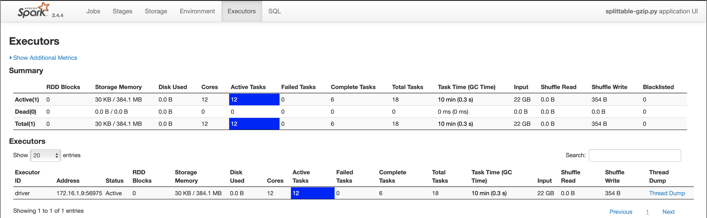

# Using the SplittableGZipCodec in Apache Spark

# Thanks !
Thanks to [Nicholas Chammas](https://github.com/nchammas) for contributing this documentation.

# Common problem for Spark users
Apparently the fact that GZipped files are not splittable is also in the Spark arena a recurring problem as you can see
in this [Spark Jira ticket](https://issues.apache.org/jira/browse/SPARK-29102?focusedCommentId=16932921&page=com.atlassian.jira.plugin.system.issuetabpanels:comment-tabpanel#comment-16932921) and
 these two questions on StackOverflow [Question 1](https://stackoverflow.com/q/28127119/877069) [Question 2](https://stackoverflow.com/q/27531816/877069).

It turns out that this library works with Apache Spark without modification.

**NOTE: The current implementation of Spark (3.0.1) creating file splits DOES NOT have an option (yet)
 to ensure a minimum split size.
 An important effect of this is that you will sometimes get an error that the last split of
 your file is too small.
 By setting the maxPartitionBytes to 1 byte below the size of a test file I was even able to get a split of only 1 byte.**
 See: https://issues.apache.org/jira/browse/SPARK-33534

# Using it
Here is an example, which was tested against Apache Spark 2.4.4 using the Python DataFrame API:

```python
# splittable-gzip.py
from pyspark.sql import SparkSession


if __name__ == '__main__':
    spark = (
        SparkSession.builder
        # If you want to change the split size, you need to use this config
        # instead of mapreduce.input.fileinputformat.split.maxsize.
        # I don't think Spark DataFrames offer an equivalent setting for
        # mapreduce.input.fileinputformat.split.minsize.
        .config('spark.sql.files.maxPartitionBytes', 1000 * (1024 ** 2))
        .getOrCreate()
    )

    print(
        spark.read
        # You can also specify this option against the SparkSession.
        .option('io.compression.codecs', 'nl.basjes.hadoop.io.compress.SplittableGzipCodec')
        .csv(...)
        .count()
    )
```

Run this script as follows:

```sh
spark-submit --packages "nl.basjes.hadoop:splittablegzip:1.3" splittable-gzip.py
```

Here's what the Spark UI looks like when running this script against a 20 GB gzip file on a laptop:



You can see in the task list the behavior described in the [README](README.md) that each task is reading from the start of the file to its target split.

Also in the Executor UI you can see every available core running concurrently against this single file:


